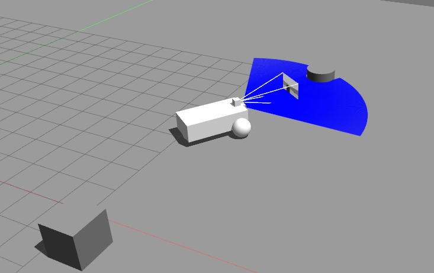

# CPPND: Ground Surveillance robot using ROS2 and Gazebo

This repo consists of a ROS2 node that communicates with a ground surveillance robot simulated in Gazebo. The goal of the surveillance bot is to drive around in a region containing a number of obstacles and capture images of these obstacles.

The robot is a differential drive vehicle with a camera and a laser scanner mounted on it. The ```arena_1.sdf``` file describes the model used in gazebo. The gazebo model publishes the laser scan and camera images via ROS2 messages at a fixed frequency. The controller node uses the laser scan to detect obstacles and to align the camera. The camera image is then saved to disk.



The code structure is simple as it consists of only one ROS2 node, see ```ControllerNode.cpp``` and ```ControllerNode.hpp```. The program is expected to maneuver the robot in the arena without colliding with any obstacles. Whenever an obstacle is detected the robot aligns itself such that the object is in the field of view of the camera and then saves an image of the obstacle (path: ```gazebo_ros2_ws/camera_images/```).

Note: This application is tested only in Ubuntu 20.04

## Dependencies for Running Locally

* cmake >= 3.5
  * All OSes: [click here for installation instructions](https://cmake.org/install/)
* make >= 4.2 (Linux, Mac), 3.81 (Windows)
  * Linux: make is installed by default on most Linux distros
  * Mac: [install Xcode command line tools to get make](https://developer.apple.com/xcode/features/)
  * Windows: [Click here for installation instructions](http://gnuwin32.sourceforge.net/packages/make.htm)
* gcc/g++ >= 9.3.0
  * Linux: gcc / g++ is installed by default on most Linux distros
  * Mac: same deal as make - [install Xcode command line tools](https://developer.apple.com/xcode/features/)
  * Windows: recommend using [MinGW](http://www.mingw.org/)
* ROS2 foxy
  * Linux (Ubuntu 20.04): [click here for installation instructions](https://docs.ros.org/en/foxy/Installation/Ubuntu-Install-Binary.html). Please follow the instructions to test ROS2 provided in the same page. It is convenient to append ```~/.bashrc``` with ```. <ros2-foxy installation path>/ros2-linux/setup.bash``` so that ROS2 is sourced everytime you open a terminal.
* Gazebo11
  * Linux (Ubuntu 20.04): easiest way to install is from apt packages (assuming ros2 foxy is already installed)

```bash
      sudo apt update 
      sudo apt install ros-foxy-gazebo-ros-pkgs
```

  Click [here](http://gazebosim.org/tutorials?tut=ros2_installing&cat=connect_ros) for more installation instructions. Please test Gazebo - ROS2 integration using the example in the link.

* OpenCV >= 4.2
  * Linux (>= Ubuntu 18.04): click [here](https://docs.opencv.org/4.5.0/d7/d9f/tutorial_linux_install.html) for installation instructions

* Docker >= 20.10.5 for building and running in a docker container. 
  * For installation click [here](https://docs.docker.com/get-docker/). 
  * You will also need any version of VNC viewer for the display - for e.g. [RealVNC](https://www.realvnc.com/en/connect/download/viewer/).

## Instructions to build and run

### Using Docker
1. Clone this repo
2. Change directory: ```cd <clone parent directory>/```
3. Build: ```./build.sh```
4. Run: ```./run.sh```
5. Connect to ```127.0.0.1:5900``` from a VNC viewer for the display

### Running locally
1. Clone this repo.
2. Change directory ```cd <clone parent directory>/gazebo_ros2_ground_suerveillance/gazebo_ros2_ws```
3. Build using colcon ```colcon build```
4. Source built packages ```. install/setup.bash```
5. Run the built package ```ros2 run surveillance_bot_gazebo ControllerNode```. Now the ROS2 node is listening for messages from Gazebo and publishing control values to Gazebo. 
6. Run the Gazebo model: ```cd <clone parent directory>/gazebo_ros2_ground_suerveillance/``` and ```gazebo --verbose arena_1```. You should see the Gazebo GUI pop up with the differential drive robot. See messages in the terminal where you started the ROS2 node for logs.

## Udacity CPP Nanodegree : Rubric evaluation

* Loops, Functions, I/O
  * The project demonstrates an understanding of C++ functions and control structures.
    * See structure of code in ```ControllerNode.cpp``` and ```ControllerNode.hpp```
    * ```ControllerNode.cpp``` L17 - L19: Passing function objects as arguments for ROS2 subscribers and publishers.
  * The project reads data from a file and processes the data, or the program writes data to a file.
    * ```ControllerNode.cpp``` L73 - L93: saving image to disk
    
* Object Oriented Programming
  * The project uses Object Oriented Programming techniques.
    * The program is structured as a ```ControllerNode``` class with member functions and attributes.
  * Classes use appropriate access specifiers for class members.
    * Private and public access specifiers are explicitly used : see L19 and L21 in ```ControllerNode.hpp```.

* Memory management
  * The project uses smart pointers instead of raw pointers.
    * Camera images, laser scans and the instances of ROS2 publishers and subscribers are all handled using shared pointers: see ```ControllerNode.hpp``` L30 to L36. Subsequent usage of shared pointers can be seen in ```ControllerNode.cpp```.

NOTE to reviewers: This program cannot be run in the Udacity workspace, please run in a local machine using docker.